FallDetection
=============

An Android app as fall-detection system.

Academic project, _Sistemi mobili e pervasivi_, Laurea Magistrale in Ingegneria Informatica, Università di Pisa.

Presentation
------------

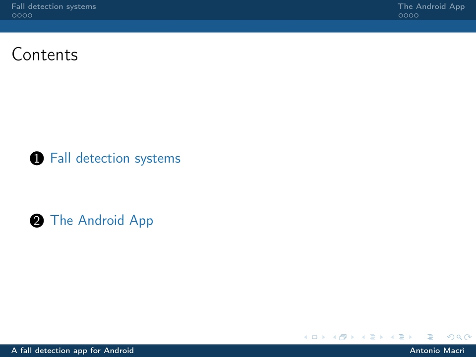

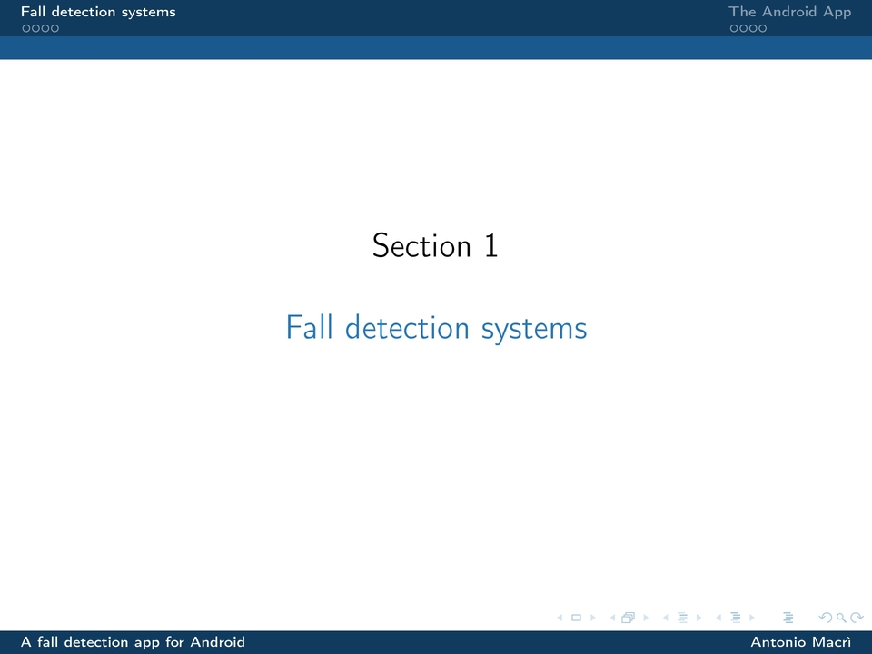

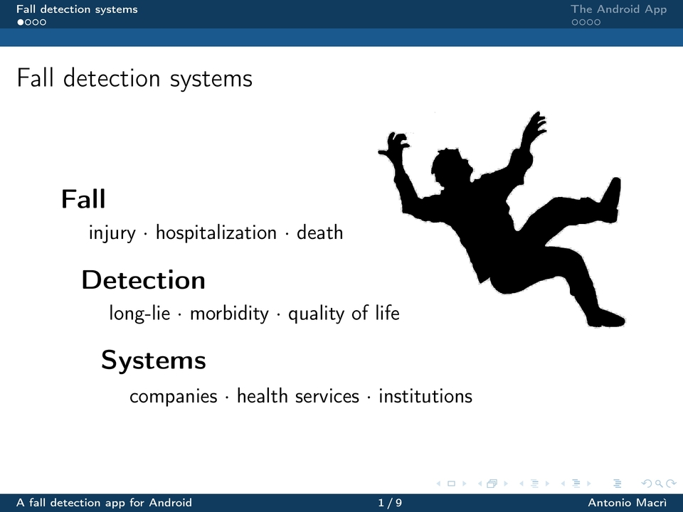

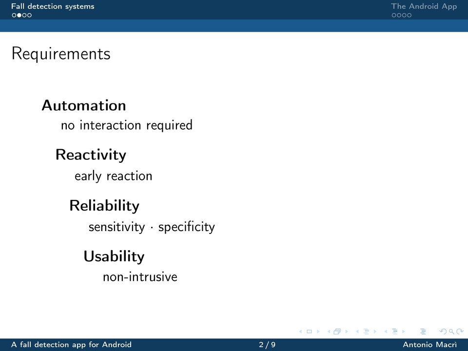

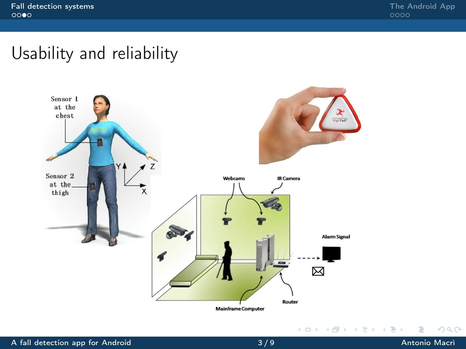

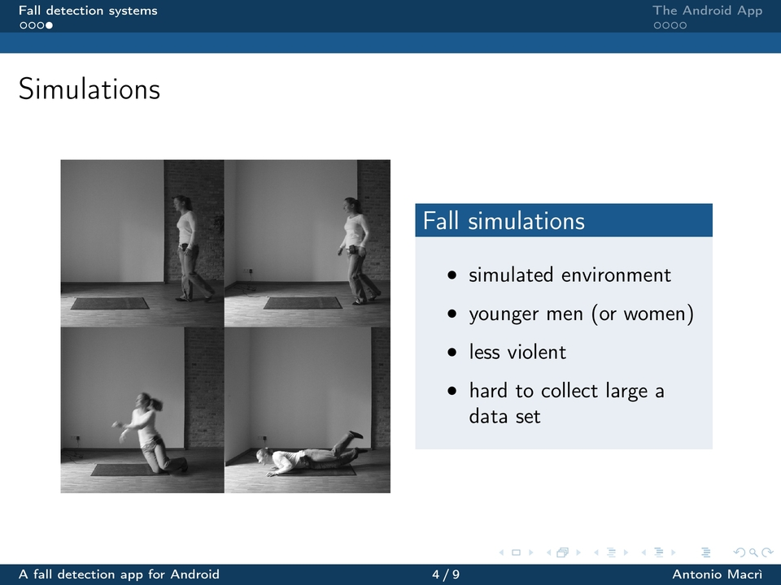

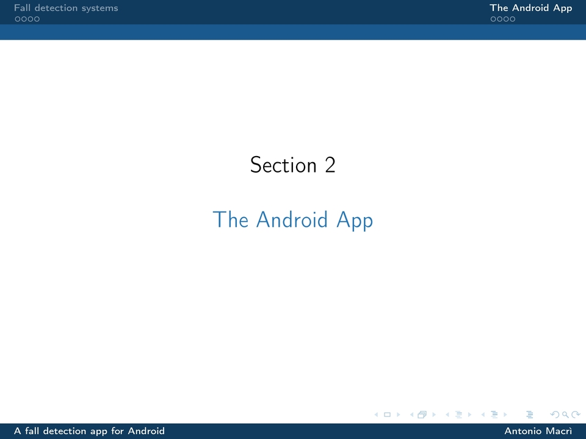

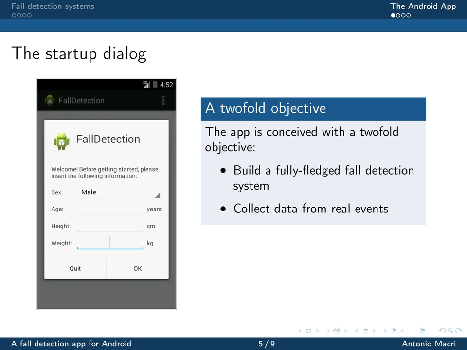

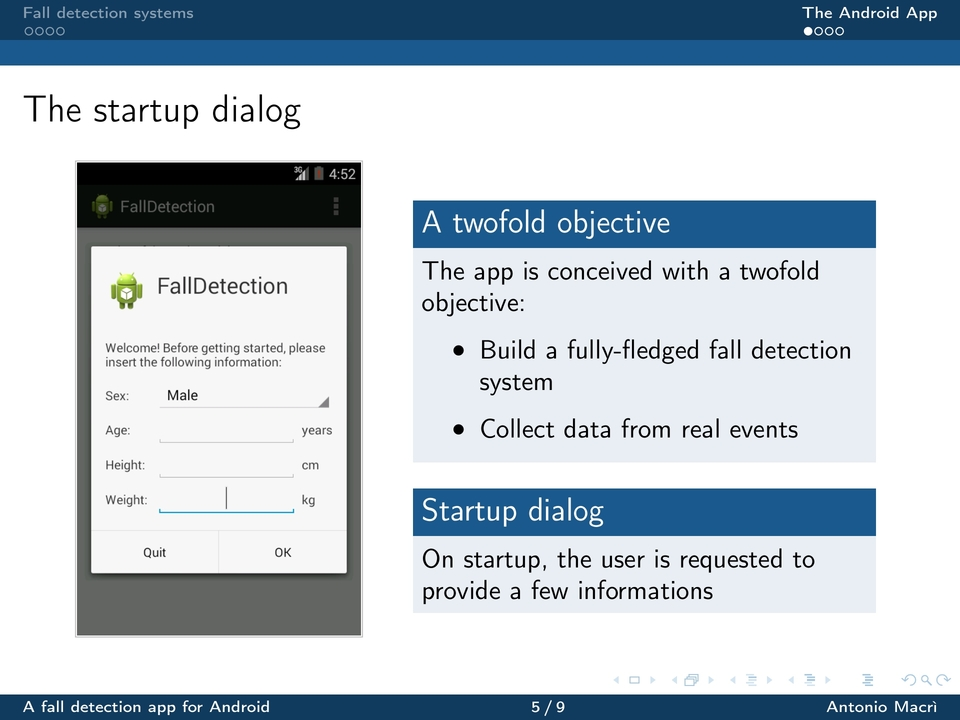

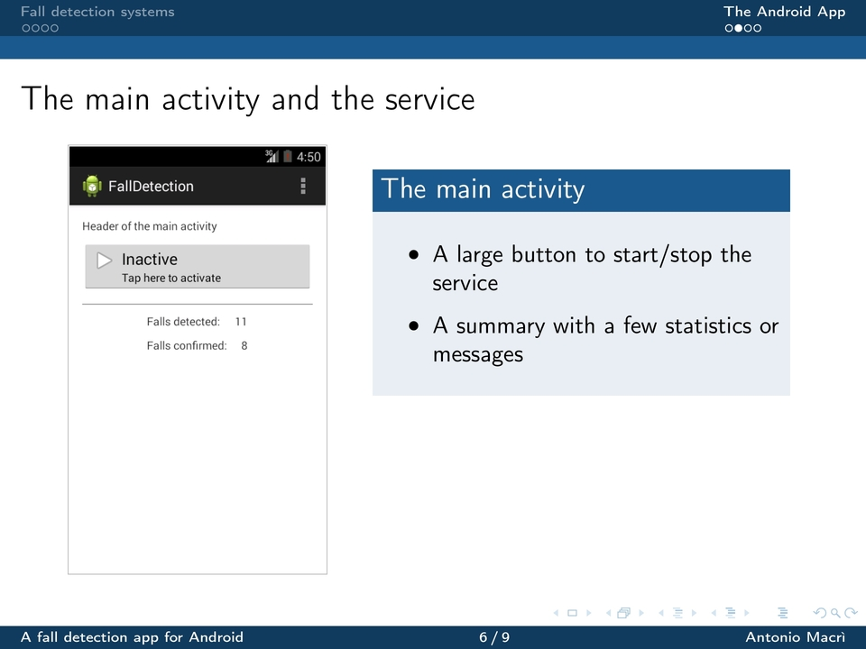

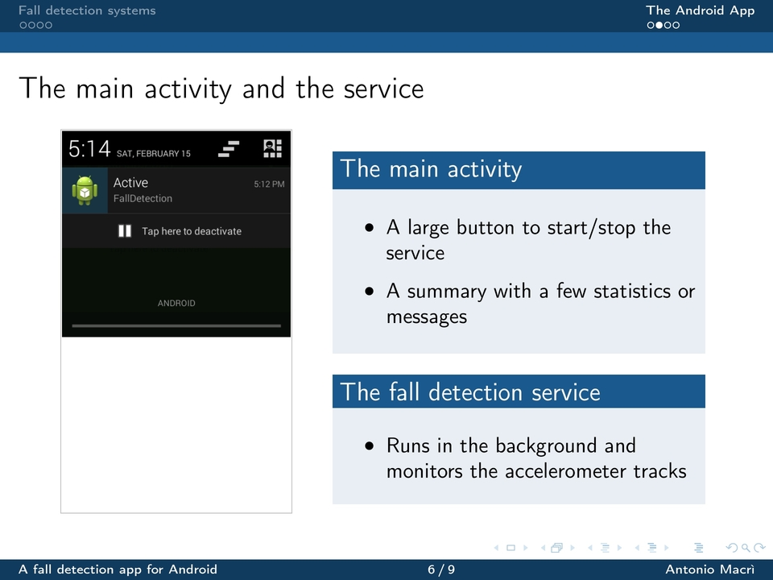

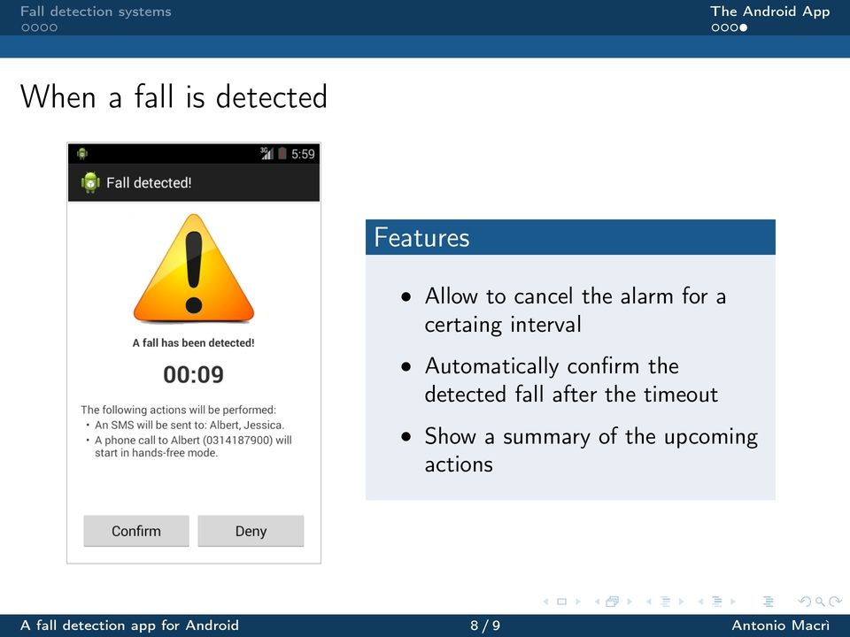

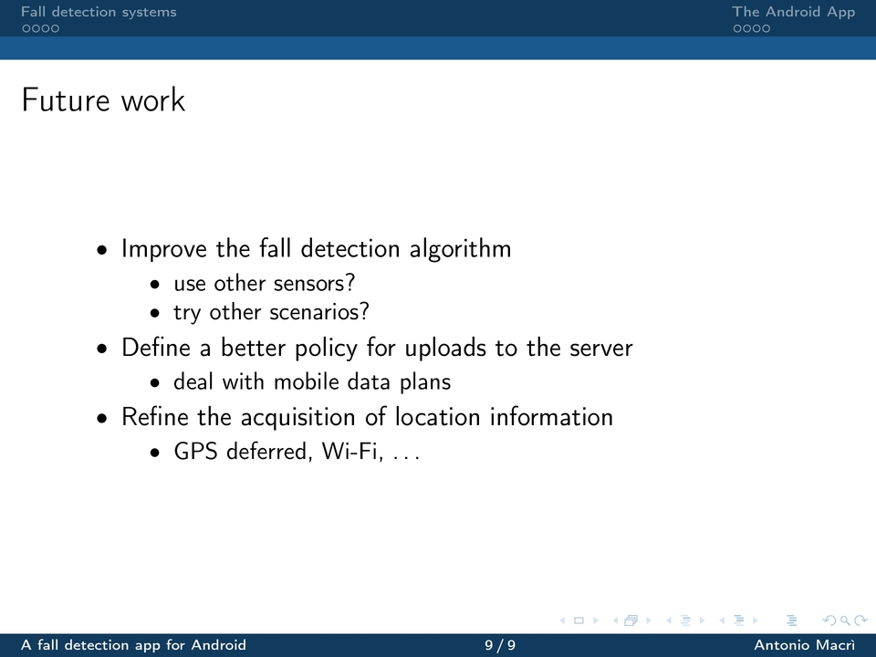

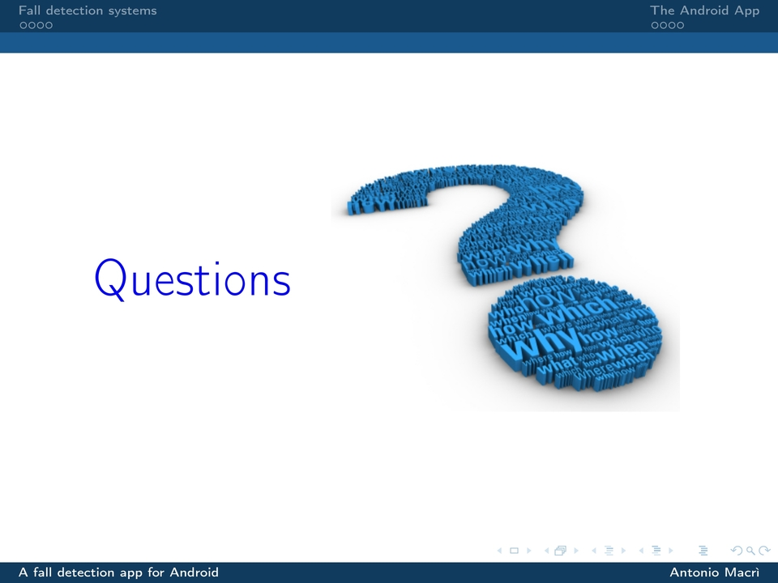
